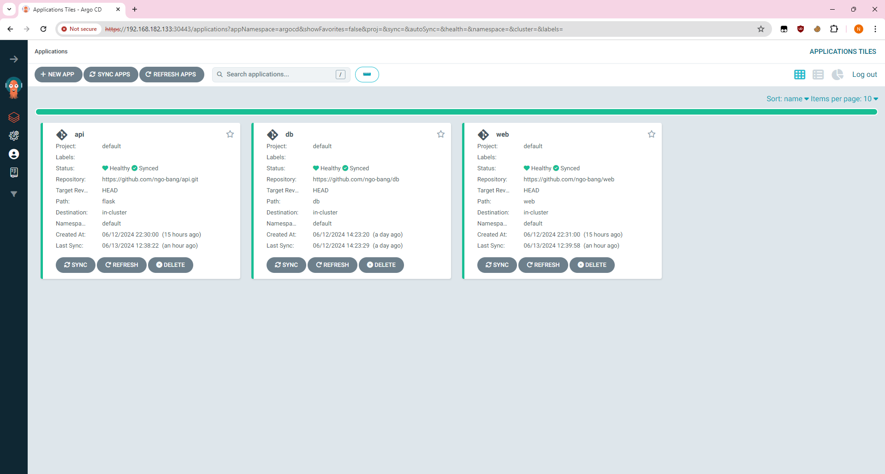
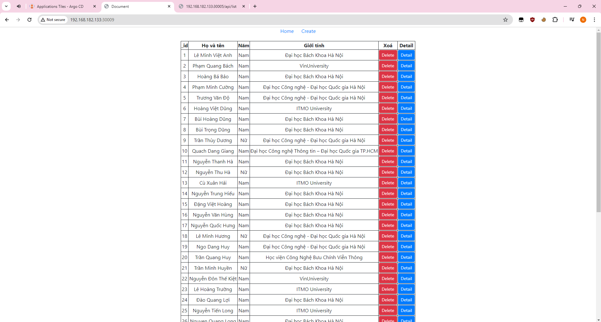
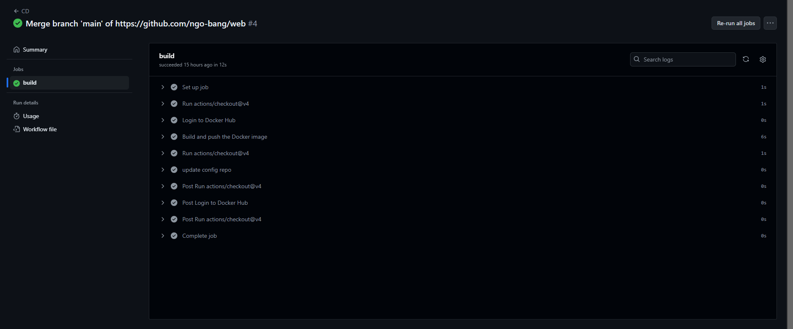
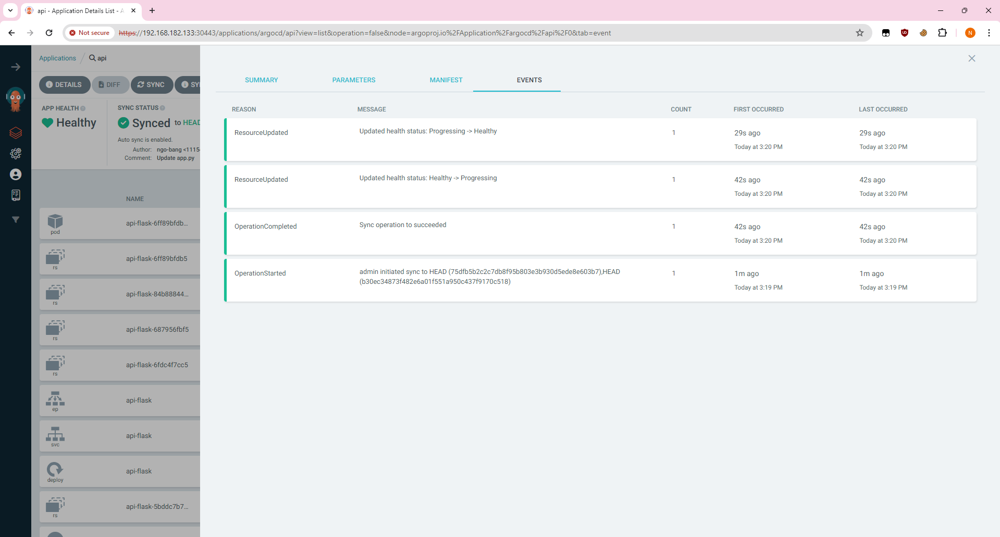
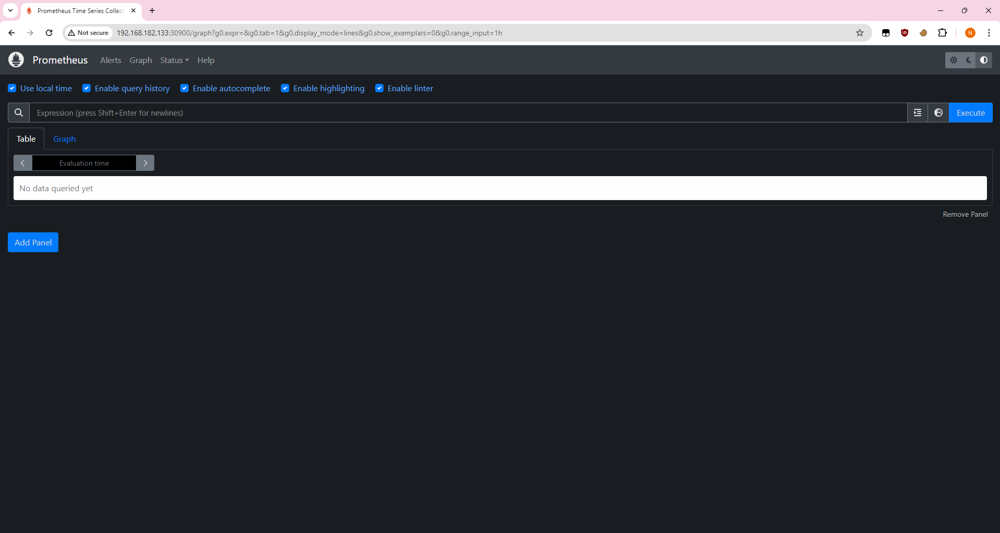
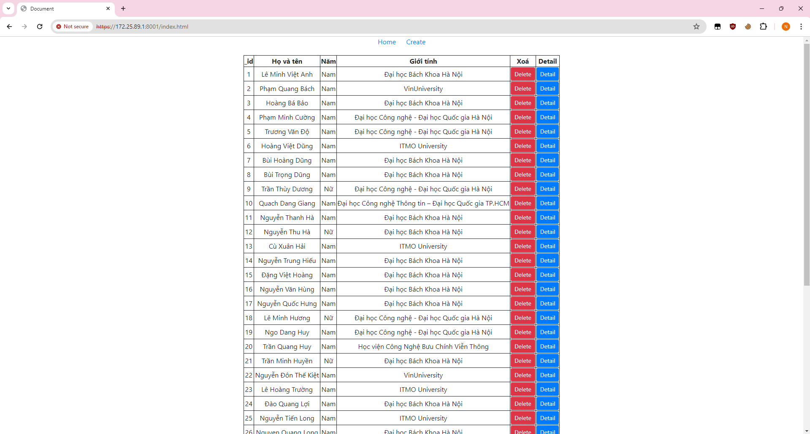

- [Triển khai Kubernetes](#triển-khai-kubernetes)
- [K8S Helm Chart](#k8s-helm-chart)
- [Continuous Delivery](#continuous-delivery)
- [Monitoring](#monitoring)
- [Logging](#logging)
- [Security](#security)
# Triển khai Kubernetes
Yêu cầu:
- Triển khai được Kubernetes thông qua công cụ minikube trên 1 node
- Hoặc triển khai được Kubernetes thông qua công cụ kubeadm hoặc kubespray lên 1 master node VM + 1 worker node VM

Output:
- [Tài liệu cài dặt](k8s.md)
- Kết quả:

# K8S Helm Chart
Yêu cầu:
- Cài đặt ArgoCD lên Kubernetes Cluster, expose được ArgoCD qua NodePort
- Trong trường hợp sử dụng cụm Lab trên Viettel Cloud, cài đặt Loadbalancer lên Bastion Node thông qua công cụ docker-compose, expose port ArgoCD ra môi trường public thông qua một trong số các port đã được cấp cho từng sinh viên.
  
Output:
- File manifests sử dụng để triển khai ArgoCD lên K8S Cluster
https://raw.githubusercontent.com/argoproj/argo-cd/stable/manifests/install.yaml
- Cài đặt ArgoCD
```
kubectl create namespace argocd
kubectl apply -n argocd -f https://raw.githubusercontent.com/argoproj/argo-cd/stable/manifests/install.yaml
```
- Expose ArgoCD qua NodePort
```
kubectl patch svc argocd-server -n argocd -p
  '{"spec": {"type": "NodePort", "ports": [{"name": "http", "nodePort": 30080, "port": 80, "protocol": "TCP", "targetPort": 8080}, {"name": "https", "nodePort": 30443, "port": 443, "protocol": "TCP", "targetPort": 8080}]}}'
```
- Kết quả

- Ảnh chụp giao diện màn hình hệ thống ArgoCD khi truy cập qua trình duyệt


Yêu cầu:
- Viết 2 Helm Chart cho web Deployment và api Deployment, để vào 1 folder riêng trong repo web và repo api
- Tạo 2 Repo Config cho web và api, trong các repo này chứa các file values.yaml với nội dung của cá file values.yaml là các config cần thiết để chạy web và api trên k8s bằng Helm Chart 
- Sử dụng tính năng multiple sources của ArgoCD để triển khai các service web và api service lên K8S Cluster  theo hướng dẫn của ArgoCD, expose các service này dưới dạng NodePort 
- Trong trường hợp sử dụng cụm Lab trên Viettel Cloud, cài đặt Loadbalancer lên Bastion Node thông qua công cụ docker-compose, expose 2 port của Web ra môi trường public thông qua một trong số các port đã được cấp cho từng sinh viên

Output:

- Các Helm Chart sử dụng để triển khai web Deployment và api Deployment lên K8S Cluster: 
  - [api Deployment](https://github.com/ngo-bang/api/tree/master/flask) 
  - [web Deployment](https://github.com/ngo-bang/web/tree/main/web)
- Các file values.yaml trong 2 config repo của web service và api service

File values.yaml của web service
```yaml
replicaCount: 1

image:
  repository: ngocongbang/web
  pullPolicy: IfNotPresent
  tag: "1.0.1"

service:
  type: NodePort
  port: 81
  nodePort: 30009
```
File value.yaml của api service
```yaml
replicaCount: 1

image:
  repository: ngocongbang/api
  pullPolicy: IfNotPresent
  tag: "1.0.3"

service:
  type: NodePort
  port: 9999
  nodePort: 30005

database:
  host: db
  port: 27017
```
- Manifest của ArgoCD Application

Api app
```yaml
project: default
source:
  repoURL: 'https://github.com/ngo-bang/api.git'
  path: flask
  targetRevision: HEAD
destination:
  server: 'https://kubernetes.default.svc'
  namespace: default
syncPolicy:
  automated:
    prune: true
    selfHeal: true
  syncOptions:
    - CreateNamespace=true
sources:
  - repoURL: 'https://github.com/ngo-bang/api.git'
    path: flask
    targetRevision: HEAD
    helm:
      valueFiles:
        - $config/values.yaml
  - repoURL: 'https://github.com/ngo-bang/config-api'
    targetRevision: HEAD
    ref: config
```

Web app
```yaml
project: default
source:
  repoURL: 'https://github.com/ngo-bang/api.git'
  path: flask
  targetRevision: HEAD
destination:
  server: 'https://kubernetes.default.svc'
  namespace: default
syncPolicy:
  automated:
    prune: true
    selfHeal: true
  syncOptions:
    - CreateNamespace=true
sources:
  - repoURL: 'https://github.com/ngo-bang/web'
    path: web
    targetRevision: HEAD
    helm:
      valueFiles:
        - $config/values.yaml
  - repoURL: 'https://github.com/ngo-bang/config-web'
    targetRevision: HEAD
    ref: config
```
- Ảnh chụp giao diện màn hình hệ thống ArgoCD trên trình duyệt


- Ảnh chụp giao diện màn hình trình duyệt khi truy cập vào Web URL, API URL 



# Continuous Delivery
Yêu cầu:
- Viết 2 luồng CD cho 2 repo web và api, khi có 1 tag mới được tạo ra trên trên 1 trong 2 repo này thì luồng deploy tương ứng của repo đó thực hiện các công việc sau:
  - Build docker image với image tag là tag name đã được tạo ra trên gitlab và push docker image sau khi build xong lên Docker Hub
  - Sửa giá trị Image version trong file values.yaml  trong config repo và push thay đổi lên config repo.
- Cấu hình ArgoCD tự động triển khai lại web Deployment và api Deployment khi có sự thay đổi trên config repo.

Output:
- Các file setup công cụ của 2 luồng CD

Api
```yaml
name: CD

on:
  push:
    tags: [ "*" ]

jobs:
  build:
    runs-on: ubuntu-latest
  
    steps:
    - uses: actions/checkout@v4
    
    - name: Login to Docker Hub
      uses: docker/login-action@v3.2.0
      with:
          username: ${{ secrets.DOCKER_USERNAME }}
          password: ${{ secrets.DOCKER_TOKEN }}
    - name: Build and push the Docker image
      run: docker build . -t ${{ secrets.DOCKER_USERNAME }}/api:$GITHUB_REF_NAME && docker push ${{ secrets.DOCKER_USERNAME }}/api:$GITHUB_REF_NAME
   
    - uses: actions/checkout@v4
      with:          
        repository: 'ngo-bang/config-api'
        token: ${{ secrets.ACTIONS_GITHUB_TOKEN }}
    - name: update config repo
      run: |
        git config user.name "GitHub Actions Bot"
        git config user.email "<>"
        sed -i 's/tag: ".*/tag: "${{  github.ref_name }}"/' values.yaml
        git add .
        git commit -m "update"
        git push origin main
```
Web
```yaml
name: CD

on:
  push:
    tags: [ "*" ]

jobs:
  build:
    runs-on: ubuntu-latest
  
    steps:
    - uses: actions/checkout@v4
    
    - name: Login to Docker Hub
      uses: docker/login-action@v3.2.0
      with:
          username: ${{ secrets.DOCKER_USERNAME }}
          password: ${{ secrets.DOCKER_TOKEN }}
    - name: Build and push the Docker image
      run: docker build . -t ${{ secrets.DOCKER_USERNAME }}/web:$GITHUB_REF_NAME && docker push ${{ secrets.DOCKER_USERNAME }}/web:$GITHUB_REF_NAME
   
    - uses: actions/checkout@v4
      with:          
        repository: 'ngo-bang/config-web'
        token: ${{ secrets.ACTIONS_GITHUB_TOKEN }}
    - name: update config repo
      run: |
        git config user.name "GitHub Actions Bot"
        git config user.email "<>"
        sed -i 's/tag: ".*/tag: "${{  github.ref_name }}"/' values.yaml
        git add .
        git commit -m "update"
        git push origin main
```
- Output log của 2 luồng CD khi tạo tag mới trên repo web và repo api
  - [api](https://github.com/ngo-bang/api/actions/runs/9494311265/job/26164419762)

  - [Web](https://github.com/ngo-bang/web/actions/runs/9485519986/job/26137648142)

- Hình ảnh


# Monitoring 
Yêu cầu:
- Expose metric của web service và api service ra 1 http path.
- Triển khai Prometheus lên Kubernetes Cluster thông qua Prometheus Operator, phơi ra ngoài dưới dạng NodePort
- Expose Prometheus dưới dạng Nodeport
- Sử dụng Service Monitor của Prometheus Operator để giám sát Web Deployment và API Deployment

Output:
- Các file setup để triển khai Prometheus lên Kubernetes Cluster

`api-servicemonitor.yaml`
```yaml
apiVersion: monitoring.coreos.com/v1
kind: ServiceMonitor
metadata:
  name: api-monitoring
  labels:
    team: vdt
spec:
  selector:
    matchLabels:
      app: api
  endpoints:
  - port: "30005"
    path: /metrics
```
`web-servicemonitor.yaml`
```yaml
apiVersion: monitoring.coreos.com/v1
kind: ServiceMonitor
metadata:
  name: web-monitoring
  labels:
    team: vdt
spec:
  selector:
    matchLabels:
      app: nginx-exporter
  endpoints:
  - port: "9113"
    path: /metrics
```
`prometheus.yaml`
```yaml
apiVersion: monitoring.coreos.com/v1
kind: Prometheus
metadata:
  name: prometheus
spec:
  serviceAccountName: prometheus
  serviceMonitorSelector:
    matchLabels:
      team: vdt
  resources:
    requests:
      memory: 400Mi
  additionalScrapeConfigs:
    name: additional-scrape-configs
    key: prometheus-additional.yaml
enableAdminAPI: false
```
- Hình ảnh khi truy cập vào Prometheus UI thông qua trình duyệt


- Hình ảnh danh sách target của Web Deployment và API Deployment được giám sát bởi Prometheus


# Logging

# Security
Yêu cầu:
- Dựng HAProxy Loadbalancer trên 1 VM riêng với mode TCP, mở 2 port web_port và api_port trên LB trỏ đến 2 NodePort của Web Deployment và API Deployment trên K8S Cluster. (0.5)
- Sử dụng 1 trong 2 giải pháp Ingress, hoặc haproxy sidecar container cho các deployment, đảm bảo các truy cập đến các port web_port và api_port sử dụng https (0.5)
- Cho phép sinh viên sử dụng self-signed cert để làm bài

Output
- File cấu hình của HAProxy Loadbalancer cho web port và api port

`haproxy.cfg`
```
global
        log /dev/log    local0
        log /dev/log    local1 notice
        chroot /var/lib/haproxy
        daemon

        # See: https://ssl-config.mozilla.org/#server=haproxy&server-version=2.0.3&config=intermediate
        ssl-default-bind-ciphers ECDHE-ECDSA-AES128-GCM-SHA256:ECDHE-RSA-AES128-GCM-SHA256:ECDHE-ECDSA-AES256-GCM-SHA384:ECDHE-RSA-AES256-GCM-SHA384:ECDH>        ssl-default-bind-ciphersuites TLS_AES_128_GCM_SHA256:TLS_AES_256_GCM_SHA384:TLS_CHACHA20_POLY1305_SHA256
        ssl-default-bind-options ssl-min-ver TLSv1.2 no-tls-tickets

defaults
        log     global
        mode    tcp
        option  tcplog
        option  dontlognull
        timeout connect 5000
        timeout client  50000
        timeout server  50000
frontend web_port
    bind *:8001 ssl crt /certs/haproxy.pem
    default_backend web_backend

backend web_backend
    balance roundrobin
    server web 192.168.182.133:30009 check

frontend api_port
    bind *:8002 ssl crt /certs/haproxy.pem
    default_backend api_backend

backend api_backend
    balance roundrobin
    server api 192.168.182.133:30005 check
```
- Kết quả truy cập vào web port và api port từ trình duyệt thông qua giao thức https hoặc dùng curl




Yêu cầu:
- Đảm bảo 1 số URL của api service  khi truy cập phải có xác thực thông qua 1 trong số các phương thức cookie, basic auth, token auth, nếu không sẽ trả về HTTP response code 403.
- Thực hiện phân quyền cho 2 loại người dùng trên API:
  - Nếu người dùng có role là user thì truy cập vào GET request trả về code 200, còn truy cập vào POST/DELETE thì trả về 403
  - Nếu người dùng có role là admin thì truy cập vào GET request trả về code 200, còn truy cập vào POST/DELETE thì trả về 2xx

Output:
- Giải pháp
  - Sử dụng thư viện flask_httpauth đê thực hiện basic auth
  - Tạo tài khoản và phân quyền cho các user
  - Sử dụng decorator @auth.login_required(role='admin') để bảo vệ URL
- Kết quả HTTP Response khi curl khi không truyền thông tin xác thực


- Kết quả HTTP Response khi curl gọi vào các URL khi truyền thêm thông tin xác thực


- Kết quả HTTP Response khi curl URL với các method Get khi lần lượt dùng thông tin xác thực của các user có role là user và admin


- Kết quả HTTP Response khi curl URL với các method POST khi lần lượt dùng thông tin xác thực của các user có role là user và admin


- Kết quả HTTP Response khi curl URL với các method DELETE khi lần lượt dùng thông tin xác thực của các user có role là user và admin


Yêu cầu:
- Sử dụng 1 trong số các giải pháp để ratelimit cho Endpoint của api Service, sao cho nếu có  quá 10 request trong 1 phút gửi đến Endpoint của api service thì các request sau đó bị trả về HTTP Response 409

Output:
- Giải pháp:
  - Sử dụng thư viện flask_limiter
  - Tạo biến limiter như dưới đây
  - Biến limiter này sẽ limit tất cả endpoint với mức mặc định là 10 requests/phút
```py
limiter = Limiter(
    get_remote_address,
    app=app,
    default_limits=["10 per minute"]
)
```
- Kết quả thử nghiệm
Thử nghiệm với code duới đây, chương trình sẽ request 15 lần liên tục đên 1 endpoint
```py
import requests
url = 'http://192.168.182.133:30005/api/get/31'
session = requests.Session()
session.auth = ('admin', 'admin')
for i in range(15):
    response = session.get(url)
    print(f'Request {i+1}: Status Code: {response.status_code}, Response: {response.text}')
```
Kết quả: 
10 requests dâu thành công và 5 requests sau nhận được HTTP respond 409
